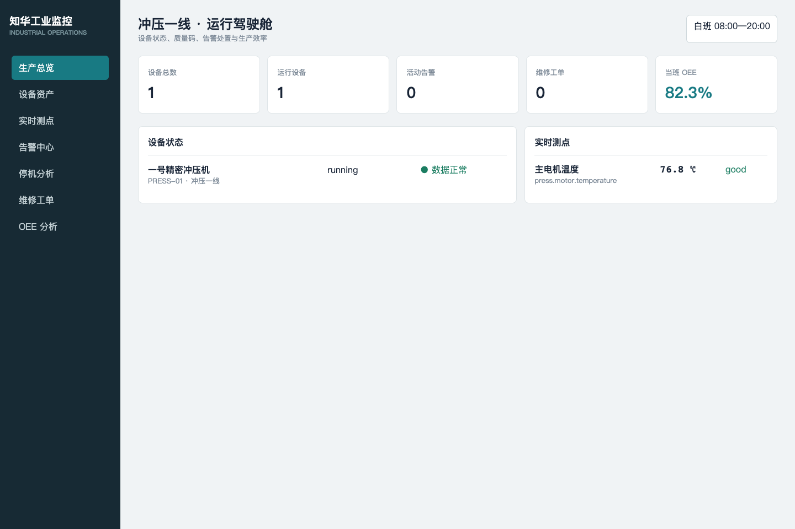

# 知华工业设备监控与 OEE 平台

[简体中文](README.md) | [English](README.en.md)

这是一个可运行、可测试的轻量工业运营系统，采用 Python 标准库与 SQLite，适合在工厂边缘服务器快速试用。它覆盖**设备资产 → 测点遥测 → 越限告警 → 确认/恢复 → 停机 → 维修工单 → 班次产量 → OEE**，而不是只画一张“工业大屏”。

[知华科技（上海如静知华信息科技有限公司）](https://www.zhuatech.cn/)维护。工业现场集成、商业授权或定制开发，请微信添加 `zhuatech` 或 `zhuatech2`。



## 企业核心能力

- 资产唯一编号、产线归属、运行/停机状态。
- 测点上下限、单位、质量码和按时间索引的遥测数据。
- 同一活动异常去重，告警 `open → acknowledged → cleared` 全流程留痕。
- 停机互斥、结束恢复、停机原因记录。
- 维修工单指派、优先级、关联告警、完成结论。
- OEE 的可用率、性能率、质量率计算与数据合法性校验。
- API Key、请求体限额、数据库外键、唯一约束和审计表。

## 运行

```bash
python3 -m unittest discover -s tests -v
MONITOR_API_KEY=zhuatech-demo-key python3 -m app.server
```

访问 `http://127.0.0.1:18084/`。生产环境建议用 PostgreSQL/TimescaleDB、反向代理与企业统一身份服务替换单机组件。

## 许可

本社区源码仅限个人学习、研究和交流，不得商用。企业内部生产、软件交付、SaaS、收费服务和其他商业用途需要上海如静知华信息科技有限公司书面授权，不属于 OSI 定义的开源许可证。

## 微信咨询

| 微信号 `zhuatech` | 微信号 `zhuatech2` |
| --- | --- |
|  |  |
